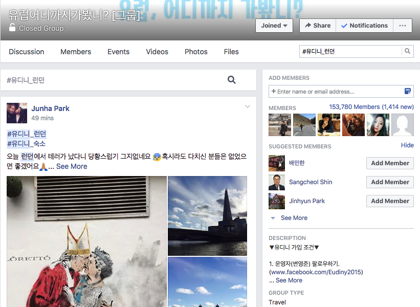
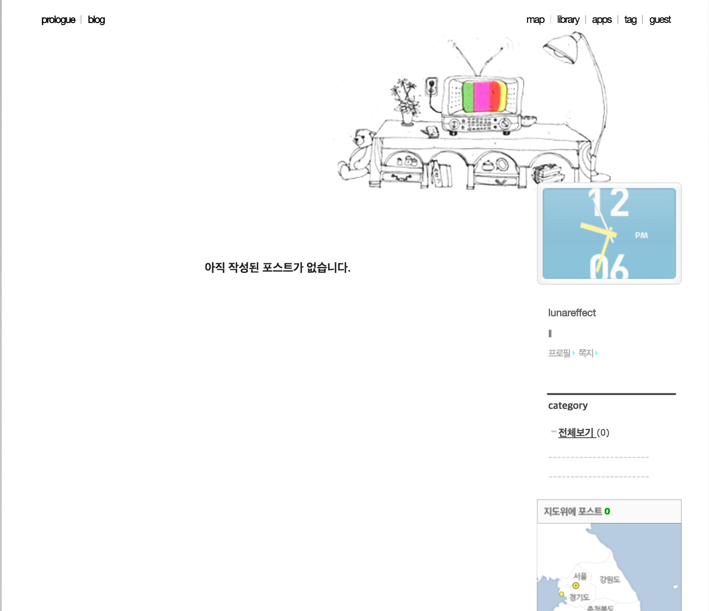

# CS374 Design Project 1 Report

**Team Old Boy**

**Members**: Dohan Kim, Eunseok Jeong, Giwan Park,  Jaekyun Kim

----------
### Experience
**Finding travel mates.**

----------
### Before the interviews
Before conducting real interviews, we tried to look around real activities happening to find travel mates.

##### References
 - Naver cafe "유랑" (community of backpackers traveling the Europe)
 - Facebook group "유럽 어디까지 가봤니?" (a.k.a. 유디니) (community of backpackers traveling the Europe)
 - Mobile aplication "설레여행" (finds travelmates)

##### We were noticed that
 - Most of the users finding travel mates from web forums or mobile applications are in their 20s or 30s.
 - Users can be divided into two groups of finding travel mates today and finding travel mates for few months later.
 - Users sometimes not only describe their itinerary but also introduce their personal characters in many aspects such as travel styles, food preferences, and even photographic skills.

----------
### Observations & Interviews

#### Interviews
- Tried to set Master-Apprentice relationship with our interviewees
- Let interviewees assume that they will travel to somewhere they want and ‘do what they usually do’.
- Used withdrawal and return scheme
- Asked what difficulties interviewees had in finding travel mates in the past

**Interviewee #1** (interviewer: Eunseok)
>**Descriptions:** 25 years old, Male, University student, from Daejeon, Traveled Europe alone for 70 days.

We assumed he is in Belgium now and about to leave for Rome in two days so let him find travel mates for Rome. He began with visiting "유디니" Facebook group and searching with the hash tag "#유디니 로마". However, most of the search results were irrelevant to finding travel mates. So he had to keep scrolling down. After the unsuccessful exploration, he moved to Naver cafe "유랑". In the "유랑동행" board, he searched with "Rome" keyword and skimmed through the titles of the search results mostly indicating travel period to see if the period match his schedule. Whenever the period matched, he went into the post and checked the contents. He sent KakaoTalk message if the contents contain the writer's KakaoTalk ID. Otherwise, he used Naver message to contact.

Interesting Moments
- He used a searching feature of facebook group but most of the search results were completely irrelevant to finding travel mates so he kept scrolling down watching unsatisfying information. 
- We asked why he keeps using "유디니" even though the search results were frustrating. He said that once he finds a candiate in the Facebook group, it is much better than Naver cafe because he could know a lot more about the candidate from his/her facebook wall.
- He traveled twice with travel mates found in "유랑". But it was unsatisfying because they only spent short time together watching a football game or having dinner and went their separate ways immediately. 
- He tried to check candidates' Naver blogs to get more information about them, but most of the blogs were empty.
- He much prefered female to male as a travel mate.

*Searched with "#유디니 로마" but most results were irrelevant with finding travel mates*

**Interviewee #2** (interviewer: Jakyun, Giwan)
>**Descriptions:** 27 years old, Male, University student, from Changwon, Has traveled with travel mates found on website over at least 10 times. (**extreme user**) 

He is a heavy user of existing services finding travel mates. He even remembered website url of "유랑" Naver cafe. We let him assume that he will be in London for 5 days from today. At first, he visited "유랑" by typing its url in a browser and searched "London" in the "유랑동행" board. Then he skimmed through the search results and verified if any of results fit to his schedule. To see detail of an article, he used command key of Macbook to open the link in new tab. If the articles contain KakaoTalk ID, he added he/she as a KakaoTalk friend to see his/her profile pictures by using his smartphone. Otherwise, he sent a Naver message to contact. He sent messages to all the female candidates whose schedule match his itinerary.

Interesting Moments
- His scheduling was so flexible that he could make minor arrangements of itinerary always according to his travel mate's schedule.   
- While skimming the search results, he mistakes "4월 22일" for "3월 22일" so he contacted with wrong person. He said it is confusing because there was too much search result rows and the date in each row has different vertical position.
- He put efforts to write polite message when contact.
- He prefered sending a KakaoTalk message or a Naver message to leaving a comment. Because a comment is viewable to public and therefore other people could realize that he is trying to contact with several people concurrently.
- He sometimes opened the same article a couple of times by accident because Naver cafe didn't mark visited links.
- Whenever it turned that a candidate is male, he immediately abandoned the candidate and continued finding process. He only contacted with women.

*Writing naver message to a candidate*

**Interviewee #3** (interviewer: Dohan)
>**Descriptions:** 23 years old, Female, University student, from Seoul, Traveled Europe during her exchange student period.

We gave her a situation that she will travel Paris alone 3 months later. She also started with searching "파리" in "유랑동행" board, and read the searched titles to find one match her schedule. She skipped a candidate if the candidate's age is far from hers. And she spent long time to check more references of candidates from Naver blogs, KakaoTalk accounts and other articles the candidates wrote. It seems that she had difficulty to remember all the posts she liked and go back to them whenever she wants. After trial and error, she started writing down the postings' url on a notepad program. After collecting all the postings, she visited them one by one again to contact with the authors. She used Naver message to introduce herself and to ask KakaoTalk ID in most cases. She said she sometimes put some questions in her messages such as "are you interested to watch musical tomorrow with me?". After sending the messages, she had to just wait for a reply without knowing whether a receiver checked the messages or not.

Interesting Moments
- She spent long time to check more references of candidates from Naver blogs, KakaoTalk accounts and other articles the candidates wrote. But it was not that successful because most candidates had nothing on their blog.
- She felt uncomfortable if the candidates set their information private.
- She said she wants there's no way to know if the candidates are good photographers.
- She said she had difficulty in the past to adapt her travel mate’s spend level so she wanted to know how much money other people are willing to spend.
- She said she had an experience that a guy supposed to meet her didn't show up and kept out of touch which made her really upset.

*Tried to find a candidate's personal references from the blog but empty blog made it unsuccessful*

----------
### Needs
#### The users want to find a travel mate who
- Visits the same city (main search word)
- Has the same or similar itinerary (screening the search results)
- Is credible or safe (checking candidates' other articles, blogs and SNS accounts)
- Has similar personal character with me
- Has similar budget constraint (an experience having difficulty to decide what to do)
- Has the same style of traveling (e.g. enjoying visiting museum vs. not enjoying)
- Has similar fatigueness of schedule (an experience suffering from walking all day)
- Can share an accommodation
- Is good at taking photos (favorable reaction to whom introducing themselves as a good photographer)
- Has similar preferences for food (an experience having difficulty to decide what to eat)

#### Also the users want
- To contact privately when they talk to the candidates

----------
### Insights
- City name and travel dates are the most important criteria to narrow down their choice.
- Criteria for finding travel mates become different according to days left to arrive the city. (a couple of days before arriving: schedule first vs. few months before arriving: personal character)
- Users want travel mates who can share personal communion rather than just a person walking through together.
- Common interests such as watching musical or football games makes people choose each other much more easily.
- Some interviewees experienced sudden disconnections with travel mate candidates. It was more frequent when they communicate anonymously than doing with real name.
- Female users are more sensitive to the guarantee that travel mate is a safe person.
- In the credibility checking, more personal information makes more credible. It can be given by detailed explanations, blog articles, Facebook posts, etc.
- Users want to settle down within their language barrier. Korean are usually finding only Korean as a travel mate.
- Women are more popular to both men and women.
- Traveling routes are a lot in common among most users.

----------
### Studion Reflections
#### I Like...
- You changed your target user from dormitory housemaster to people finding travel mates. 
- How you tried to find target users before conducting real interviews.

#### I wish...
- You consider strong points of existing solutions. I think the most important factor is number of users.
- You consider and decide who would be the extreme users.

#### What if...
- You expand the target users to people in various age.
- You consider the elderly tended to use package tour program provided by "하나투어" or "모두투어".

#### Reflections
There were statements about the extreme users. So we are planning to find critical factors which differentiate our target users into broad spectrum. Finding the factors will enable to decide who the extreme users are.
