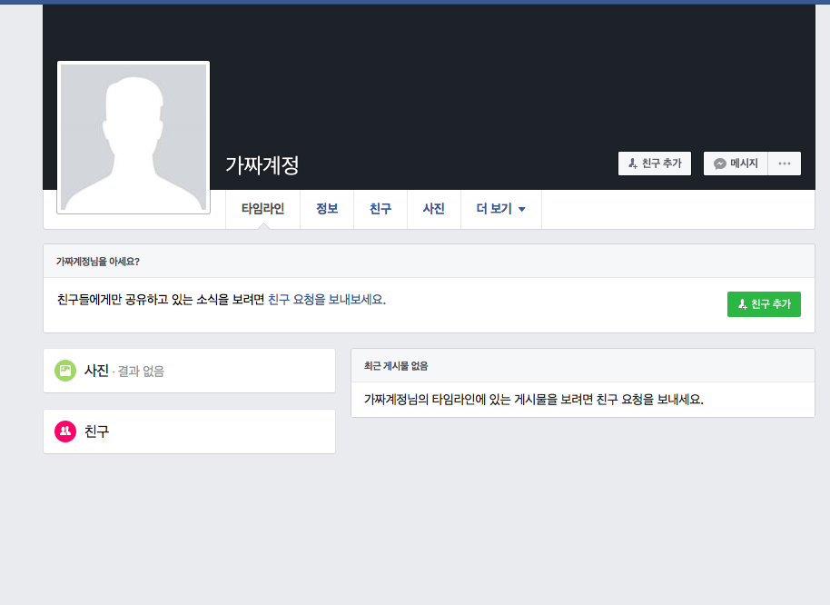
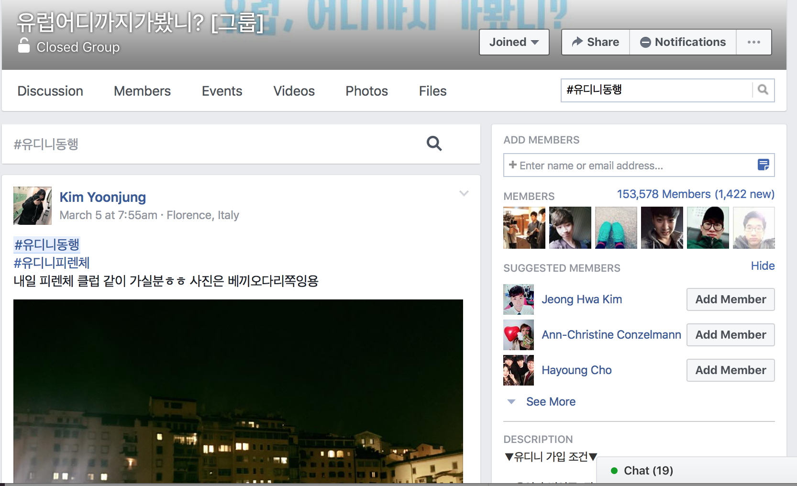

# CS374 Design Project 1 Report

**Team members**: Dohan Kim, Eunseok Jung, Giwan Park,  Jaekyun Kim

----------
### Experience
**Finding a travel-mate.**

----------
### Observations & Interviews
#### Interview preparation
Before conducting real interviews, we tried to look around real activities finding travel mates.

##### Services finding travel mates
 - Naver cafe "유랑" (community of backpackers traveling the Europe)
 - Facebook group "유럽 어디까지 가봤니?" (a.k.a. 유디니) (community of backpackers traveling the Europe)
 - Mobile aplication "설레여행" (finds travelmates)

##### We were noticed that
 - Most of the users finding travel mates in web services are 20s or 30s.
 - Some posts have several replies, but other have a few replies.
 - The posts finds travel-mates for today or for couple of months later.
 - The finders describe their characteristics in many aspect not only the itinerary and traveling city, but their personalities, travel style, food preference, and even photo taking skills.

#### Interviews
- Tried to set Master-Apprentice relationship
- Let them assume that they will travel to somewhere they want in two days and ‘do what they usually do’.
- Used withdrawal and return scheme
- Asked if they had any difficulty while finding a travel mate in the past

**Interviewee #1** (interviewer: Eunseok)
>**Descriptions:** 25 years old, female, university student. She is from Seoul city, and traveled Europe alone for a month.

Interesting Moments

- She searched facebook page with city name and kept scrolling down even though the search results was not that useful.
- She spent long time to check candidates’ personal information looking Facebook posts or Kakaotalk profile.
- She felt uncomfortable if the candidates set their information private.
- She said sharing food and taking photographs are important virtues of travel mates.

**Interviewee #2** (interviewer: Dohan, Jakyun, Giwan)
>**Descriptions:** 25 years old, male, university student. He is from ..., and traveled Europe alone for 70 days.

Interesting Moments

- He kept scrolling "유디니" Facebook group, when he has no specific purpose.
- He prefer cauchsurfing where he can get free accomodations to travel-mates. When he got travel-mate in "유랑", the relationship between him and mate is almost business relationship. From this relationship, he felt frustrated, so he prefer couchsurfing that have more familiar communication with house-owner than just travel-mates.

**Interviewee #3** (interviewer: Jakyun, Giwan)

----------
### Needs
#### The users want to find a travel-mate who
1. visits the same city
2. has the same itinerary
3. is credible or safe
4. has similar personal character with me
5. has similar preference for food
6. has similar budget constraint
7. has the same style of traveling like visiting museum, art gallary, or landmarks.
8. has the similar volume of schedule
9. can share a accommodation
10. is good at taking photo

----------
### Insights
1. Finders starts serching with city names first, and compares date that candidates stay in the city. In this observation, The city name and date are the important metrics to narrow down their choice.
2. Finders want many good aspect from travel-mates. It seems like they want disposible friend, not just bodyguard or person with itinerary. Probably, they want emotional connection with travle-mates.
3. Some interviewees talked about the sudden disconnection with travel-mate candidate. However, they added when they communicate with Facebook, it is less likely to occur the sudden disconnection than anonymous KakaoTalk. When people are anonymous, they make disconnection more easily.
4. When the users find travel-mates of tonight, they take care about the date and location only. However, when they find travel-mates for trip in a couple of months later, they starts consider many things.
5. Female interviewees showed the action that checks whether the candidates are credible or not. For example, checking the KakaoTalk profile or checking the Facebook account. At this point female finders want to know about candidate's credibility.
6. In the credibility checking, more personal information makes more credible. It can be checked with blog articles, Facebook posts, concrete explanations, etc.
7. Basically, "유랑", and "유디니" is Korean community. Also, if the interviewee had the chance to get foreign travel-mates in hostel, they said they avoided getting foreign traveler. These situations are caused by language barrier between Korean and English.
8. In community observation, some posts had more replies than other posts. Most of them are female's posts, but the replies are mixed. It means female is more popular than male in candidate pool.
9. In community observation, most of the cities are popular city. There are common cities to travel with travel-mates.
10. There are some critical factor that makes users decide travel-mate for each other. Although, the candidate has obvious disadvantages, when the candidate has suggestion to do the special activity, like watching musical, and the user loves musical, he decides the candidate as travel-mate.

----------
### Studion Reflections
#### I Like...
- Your determination that change the topic.
- Your process that tries to find good target user.

#### I wish...
- You concern more about the human factor. In my experience, big human pool is critical factor in this problem.
- You concern about the extreme users.

#### What if...
- Expand the population to age axis.
- The old agers are tend to use package tour like "하나투어", "모두투어", think about it.

#### Reflections
In studio feedback, there are several statements about the extreme users. In this reason, we think about the extreme users in our topic, finding travel-mates. We conclude that our extreme user can be determined by travel frequency or financial budget. With this matircs, we need more interview or survey, and we will be able to understand about our extreme users.
