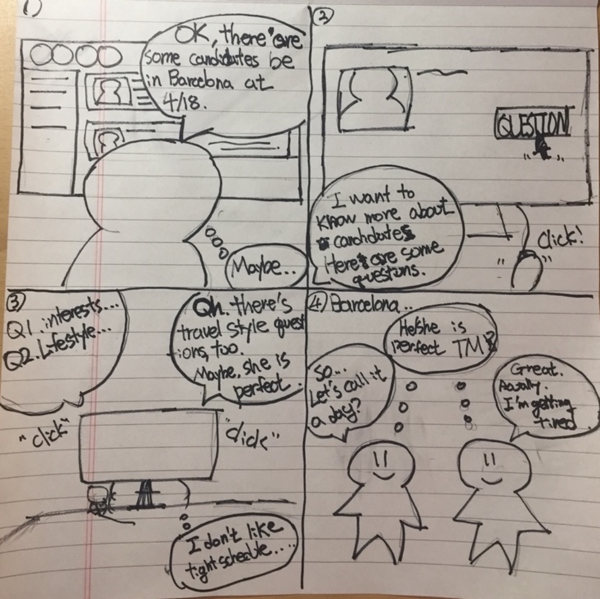

# CS374 Design Project 2 Report

**Team Old Boy**

**Members**: Dohan Kim, Eunseok Jeong, Giwan Park, Jaegyun Kim

----------
###  Experience : Finding travel mates.

----------
### POV

**Single travelers** need to **find attractive travel mates** because **travel is also an event looking forward to coincidental happenings with attractive people.**

----------
### Persona

>_I plan a travel just before joining my first company! I want to go London, Rome, and Paris. I want to find a friendly, kind, attractive man who will be my travel mate in this summer:)_

#### Name: Soohee Han

#### Personal Records
- Female
- 25 years old
- Majoring in French and French literature
- Not in a relationship for 6 months
- Using iphone
- Have traveled West Europe during her gap year
- Have traveled Osaka with her friends last year

#### Goals and Values
- Wants to take photos at famous spots and upload it on Instagram. 
- Wants to find a travel mate who is handsome and active
- Prefers flexible travel plan
- Believes travel should be happy

----------
### HMW Questions
Each team members brought out 5+ HMW questions. After gathering each members' questions, we reorganized them by merging similar questions, and correcting too broad or narrow questions. As a result, We picked 12 HMW questions.

#### How might we
- Help people choose attractive person well?
- Offer environment in which people feel attracted to each other easily?
- Make people do not just pass by their ideal travel mates?
- Help people who are not in a relationship to travel more?
- Connect people who have similar interests?
- Make people find travel mates before they leave home?
- Make study groups for preparing travel?
- Make people could approach to others more easily during travel?
- Give people assignments they can do with travel mates?
- Gather and share information about travel mate’s interests?
- Help people avoid suspicious travel mate candidates?
- Help people easily meet in foreign country?

#### Selecting top 3 HMW Questions
After taking a vote, we discussed what to choose among the HMW questions which got many votes with following criteria. After the discussion, 3 HMW questions were selected.
- It should be related with the POV.
- It should be distinct each other.
- It should not be too broad or narrow.

#### Top 3 HMW Questions
- How might we help people choose attractive person well?
- How might we offer environment in which people feel attracted to each other easily?
- How might we make people do not just pass by their ideal travel mate?

----------
### Solution Ideas
For each HMW questions, we spent 15 minutes for brainstorming to devise solutions. Finally we got 10 solutions per a HMW question.

- How might we help people choose attractive person well?
  - Making candidates upload their photos.
  - Making a review system that user can check feedbacks from previous travel mates.
  - Making candidates write their introduction.
  - Skype call with candidates.
  - Giving their mutual friends's recommendation.
  - Making a ban list which including all of characteristics users want to avoid as travel mates.
  - Showing candidate's SNS account.
  - Offering various personal information about candidates such as interests, values, and travel style.
  - Making users actually meet their candidates before their travel.
  - Showing candidate's travel history.

- How might we make better environment in which users can appeal better to each other?
  - Giving assignments to make people hang out.
  - Listing up activities available in the specific city and make each activities’ chat room.
  - Recommending nice places to hang out with travel mates.
  - Grouping people by their interests.
  - Give a chance to give a gift to each other.
  - Having talent show for each other.
  - Giving advice about fashion style.
  - Showing nice pictures taken in their previous travels.
  - Giving communication tools to help their first meeting in reality.
  - Matching with local tour guides.

- How might we make people do not just pass by their ideal travel mate?
  - Introduce some restaurants that many single travelers prefer.
  - Introduce some place that would be better if going there together. 
  - Making photo timeline from which users can check out other travelers’ activities in close distance.
  - Creating instant groups for people in the same area.
  - Giving candidates list in a specific city.
  - Grouping people using same transportation.
  - Giving a signal when a user is passing by any candidates.
  - Giving candidates list with their accommodation information.
  - Offer notification service in even none wifi zone so that avoid a situation that single travelers can not meet because of unavailable connection.
  - Reschedule users’ travel schedule to fit with the schedule of the travel mate.

### Selecting top 3 Solution Ideas
After taking a vote, we discussed what to choose among the solutions which got many votes with following criteria. After the discussion, top 3 solutions were selected.
- It should be related with the POV.
- It should be distinct each other.
- It should have many aspects to research and experiment
- It should be fun to develop during the semester.

#### Top 3 Solution Ideas
- Listing up activities available in the specific city and make each activities’ chat room.
- Offering various personal information about candidates such as interests, values, and travel style.
- Making photo timeline from which users can check out other travelers’ activities in close distance.

----------
### Storyboards

#### List up activities and make each activity’s chat room.

One day, a guy traveling moved from Paris to London by train. In the train, he was trying to find someone to watch Lion King musical with. In a chance, he found a chat room about Lion King in our application. When he joined the chat room, people in there had already had an appointment to watch the musical together. Therefore, He asked them if he could join the group and finally, they watched the musical together.

#### Offer various personal information about candidates such as interests, values, travel style.

In this storyboard, one guy want to get travel mate for his Barcelona trip at April 18th. After he found some candidates that met his condition, Barcelona, 4/18, he tried to know more about each candidate checking their answered questions. In the questions, there are candidates’  interests, value, and travel style, so he can judge whether the candidate is fit with him or not. After the checking stage, he is satisfied with his travel mate.

#### Make photo timeline from which users can check out travelers’ activities in close distance.

A beautiful woman traveled in Paris alone. When she went to the Eiffel Tower, she felt unexpectedly lonely. She want somebody to travel with her. Therefore She saw a photo timeline in our application and she could see a picture taken by a handsome guy near by the Eiffel Tower in a few minutes ago. And she sent him a message to meet. Finally, they had a good time at the Eiffel Tower.

----------
### Studio Reflections

#### I Like...
- first solution because reflects real situation.
- third solution because traveler could find their travel mate in travel! (Not before the trip)
- focus your user to a single traveler

#### I wish...
- slightly modify your POV's wording or solution. Your app looks like a dataing app, not a travel app.

#### What if...
- think considerately about how you arrange traveler's actual time and place
- focus on security issue(prevent strange user) for female traveler

#### Reflections
- contents

----------
### More Needfinding (Updates in DP1)

We did interview again and get few more insights.

**New Interviewee #1** (interviewer: ALL)
>**Descriptions:** 23 years old, Female, University student, from Daejeon, exchage student in Italy, Traveled Europe alone for about 2 months.
>
>**Observations** : We assume that she will be in London in 3 days and see how she acts in online. 

#### new insight:

- Female prefer Male as well
(Our previous insight was female prefer both gender)
- how to filter strange person(normally man) will be our challenge issue
- After traveler send message to their travel mate candidate, they may wait unitl 3~4 hours. After that they could consider that request is finished
( we should think about how can we make user reply fast / in time)
- Profile picture is very important in choose travel mate in online
- We can develop some ideas about make events with Korean domitory(한인민박) 
