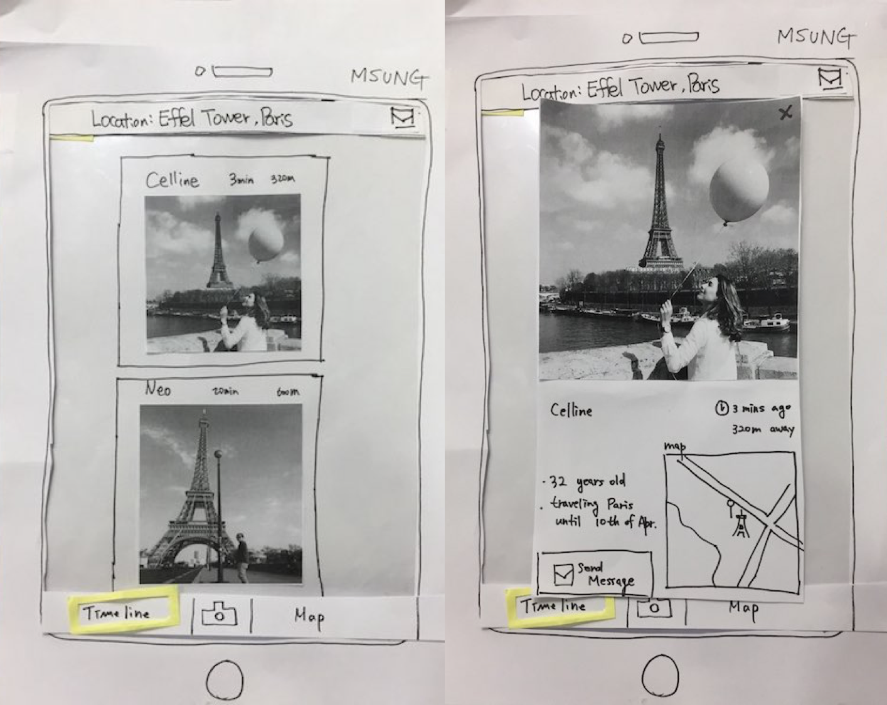

# CS374 Design Project 3 Report

**Team Old Boy**

**Members**: Dohan Kim, Eunseok Jeong, Giwan Park, Jaegyun Kim

----------
###  Experience : Finding travel mates.

----------
### Prototype

#### A user can find a travel mate from the photo timeline which shows recently taken photos near the user.
If a user clicks any of these photos, detail information page will be popped up and the user can send a message by pressing 'Send Message' button.

#### A user can find a travel mate by from the map containing pins indicating other users' position.
If user click any of these pins, detail information will be popped up and the user can send a message.

#### By clicking camera icon, a user can select their photos and upload them to the timeline.
We use photograph for 'photo timeline' feature. Because its name is 'photo timeline', we decided to print out photo that user recognize it as 'photo timeline' easily.

----------
### Participants

#### Person 1.
- She is 23 years old, Junior student in SoC. 
- She has traveled with friends twice and has a plan to travel alone.
- She said that she might want to search a male travel-mate while traveling alone.
#### Person 2.
- She is 22 years old.
- She has traveled with family more than five times.
- She plans to travel alone in Brazil during summer vacation and tries to find a travel-mate.
#### Person 3.
- He is 25 years old. Senior student in MS.
- He has traveled alone in Korea many times
- He plans to travel alone abroad before getting a job.

----------
### Briefing

This is the interface test for design project in CS374, Introduction to Human-Computer Interaction course. This application helps users to search travel mates by a photo timeline and a map with pin points. The users want to implement this application when they have any troubles to find travel mates. In this service, users can compare photos which are uploaded by other users, or check other users’ location where they uploaded the photo. These photos are almost real-time, so users can get travel mate as soon as possible, by sending the messages. On the other hand, the users can check close travelers' photo in map view. In this case, users can choose closest person as travel mate. Plus, users can upload photos.

----------
### Task & Observations

#### Observations for Task 1 (After watching the timeline, find a travel mate you want to travel with and send a message.)
- There was no action even if the user clicked a map in a photo pop-up page. (Medium) - P1
    - We need to add an action to show the map view with the location point of the photo.
- The users could not figure out the meaning of a timeline button in the main page. (High) - P1, P2
    - We need to reconsider the wording of "Timeline" button.
- If the users sent a message to contact new candidate and waited for the reply from the candidate but coincidentally received new arrival message from other candidate, then they got confused about the context of the new arrival message because they expected the message would be the reply. (High) - P2, P3
    - We need to design differently between new arrival message and a reply.

#### Observations for Task 2 (After watching a map, find a travel mate you want to travel with and send a message.)
- The user asked about the time at a pin-point. (Medium) - P1
    - We need to consider design of the time at a pin-point
- The users clicked a cancel button by mistake in the message page. (High) - P1, P2
    - We need to consider position of the cancel button.
- The users asked auto-saving a draft message. (High) - P1, P2
    - We need to add auto-saving feature in writing a message.
- There was too few information that a pin-point contains to choose an appropriate candidate. (Medium) - P2
    - We need to add a photo in addition to the time and gender information at a pin-point.

#### Observations for Task 3 (Upload photos that you took in your place.)
- The users wondered why clicking a select button again although they already selected the image in the album. (High) - P1, P2, P3
    - We need to reduce unnecessary clicks
- The user asked the way to watch images he uploaded. (Low) - P3
    - We need to make a profile page to watch the user's personal information.
- The user wondered why a image was popped-up right after he uploaded the image. (Low) - P3
    - Instead of popping up, We need to show an alert that the image is uploaded well and make an album that the user can watch images they uploaded.

----------
### Individual Reflections

#### 1. Dohan Kim
- What role did you play in each round?
P2: Facilitator, P3: Computer

- What were some of the difficulties you faced playing the role(s)?
As a facilitator, the most hard part was encouraging users to think aloud. They were not used to do that, and even though I asked 'What are you thinking now?' or 'Why did you do that?' often, their answers were not that considerate or meaningful. So I felt that especially in low-fidelity prototype testing, it's really important to find good users who are interested in our service a lot and also feeling difficulties to accomplish the tasks we want to help. Otherwise, there are not much things bored users can do with low-fidelity prototypes so it is unlikely that the users can give nice feedbacks.

- In what way was paper prototyping useful in your project?
By paper prototyping and testing, we were able to confirm that overall flows of the UI were quite understandable to the users. But we were also able to find some problems from which users can be confused such as messaging UI. Thanks to paper prototyping and user testing, now we can modify our UI design without too much cost in early stage. Otherwise, we would have spent long time to modify actual source code. 

- What did your paper prototype not cover or test?
A lot of negative feedbacks from the user testing were related to low fidelity of breadth. For instance, users tried to interact with miscellaneous UIs in the paper prototype and failed because we didn't make the functions yet. These kind of problems will be naturally resolved when we really develop our service. So I felt that in a user testing process with a paper prototype, we have to focus on high-level goals of users rather than detail flaws. As it is cheap to create a paper prototype, it needs more cautions and skills of testers(UI designers) for user testing. 

#### 2. Giwan Park 
- What role did you play in each round?
My role is computer in both two interface tests.
- What were some of the difficulties you faced playing the role(s)?
    - My response was not fast enough, so the users should wait my response.
    - If I was not spread all the windows or popups, I spent more time to find right popup paper.
    - When user swiped up the screen to scroll down the timeline, I was compused whether I move the timeline up or down. After I checked the direction myself, I can move it proper direction.
- In what way was paper prototyping useful in your project?
Testing paper prototype, we can know our UI is quiet well functioning like browsing the timeline or sending message. However, there are several learnability issues such as not to be able to find the proper button. We were noticed to that issue while doing some interface test.

- What did your paper prototype not cover or test?
Our prototype could not test real reply from travel mate candidates. Also, although we have plans to adapt the filter helping user select candidates, the prototype does not have any function related to that solution.

#### 3. Jaegyun Kim
- What role did you play in each round?
I was an observer and a facilitator in the first and third interview, respectively.
- What were some of the difficulties you faced playing the role(s)?
    - I tried to capture the user's feelings from the observer's point of view, but I was so busy that I only wrote things that the user acted and spoke.
    - When I was a facilitator and didn't read the material before the user test, Understanding the user's condition was really difficult. Unfortunately, the user stopped the test. 
    - Therefore, I read the material and memorized the details to prepare the user test. But It was still hard to test smoothly.
- In what way was paper prototyping useful in your project?
    - We have found some elements that seem like actionable objects but actually don't work such as a map in a photo pop-up page or a top bar containing current location information.
    - There were some users that closed a message which had contents written but wasn't sent yet. So, we found that we need to make auto-save feature.
- What did your paper prototype not cover or test?
    - Our paper prototype has a photo pop-page with bigger size photo for only one case. Thus, the prototype could not offer other various interactive contents to users. By this reason, we could not capture the user's feeling that could have been gotten with various photo contents.

#### 4. Eunseok Jeong
- What role did you play in each round?
P1: Facilitator, P2: Observer, P3: Observer
- What were some of the difficulties you faced playing the role(s)?
    - Originally facilitator should not explain in detail and watch user. However user kept question me and i did explain a lot. Additionally I supposed to stop them periodically and ask about reason that they did, but it was hard as well. 
    - (When observe user) If user touches fast, it’s very hard to find some critical moments. Working hand in hand between facilitator and observer is very important.(e.g. facilitator could stop user when user do their task so well)

- In what way was paper prototyping useful in your project?
    - We could test that user can follow our scenario that we expect or if they really understand what we made.
    - Since we made this paper prototype, we are used to it and maybe we could miss some important problem. But user can see for the first time, and maybe they could find big issue. This lead our team to save our time. (Change our prototype by various issue before development begin)

- What did your paper prototype not cover or test?
    - Basically our service need at least two user. (because someone should find ‘real user’) But it’s very hard to test two user with paper prototype. Therefore we need to make ‘virtual character’ based on our imagination. However in real world, it’s very hard to expect what user will upload. Therefore there is a possibility that our simulation is quite different from user’s actual behaviour. This problem is common problem in service related to C2C(customer-customer) business model.

----------
### Studio Reflections

#### I Like
- Your overall design.
- Your idea of service.
- Your UI appropriate for task.
- Your idea that user can find travel mate by photo.
- You choose distinct task well.

#### I Wish
- Your service has special feature with safety issue.
- You should check that your service works normally in web browser.

#### What If
- Add filter setting on photo timeline?
- Add some special information on the map (restaurant or performance) that user can find travel mates not only with photos?
- Remove margin on the phone that user can see photo much bigger?

#### Reflections
- For this application, we will develop on a web app environment.
- We will try to enlarge a timeline’s pop-up view by reducing unnecessary margin.
- We will take discussion later about safety issue and etc.
