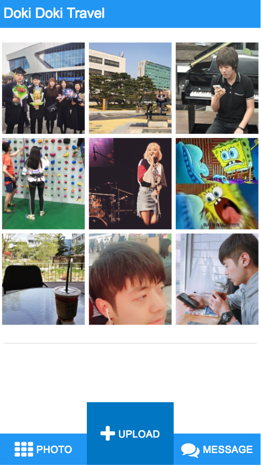
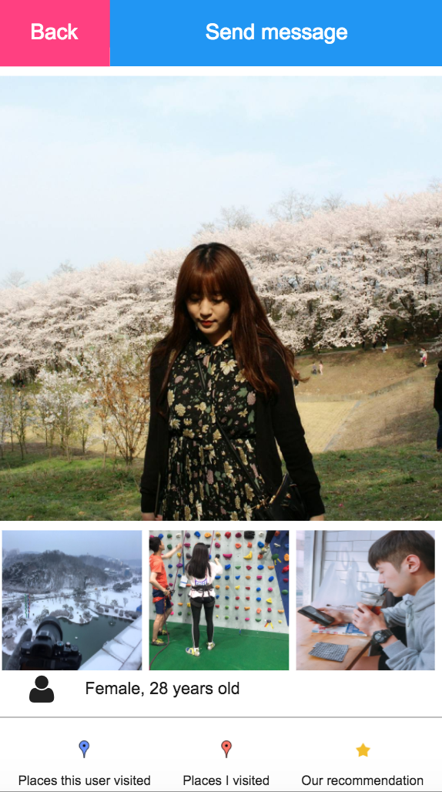
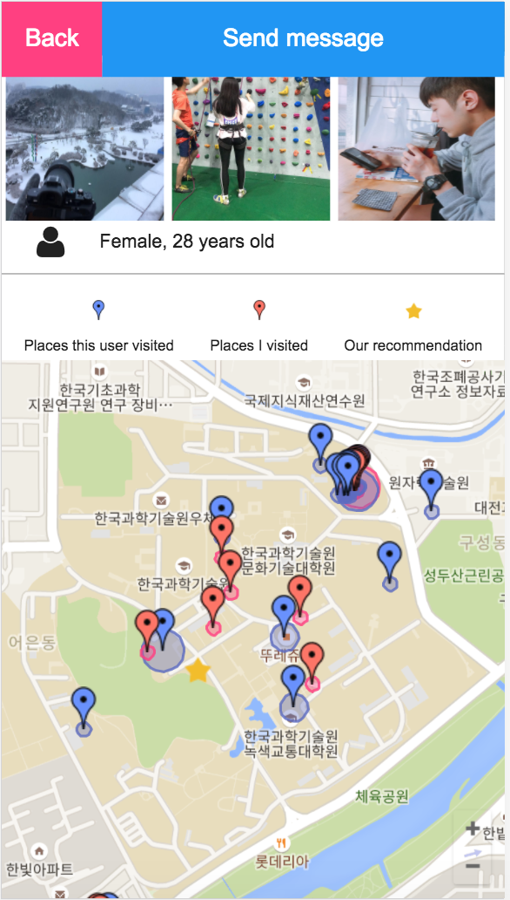
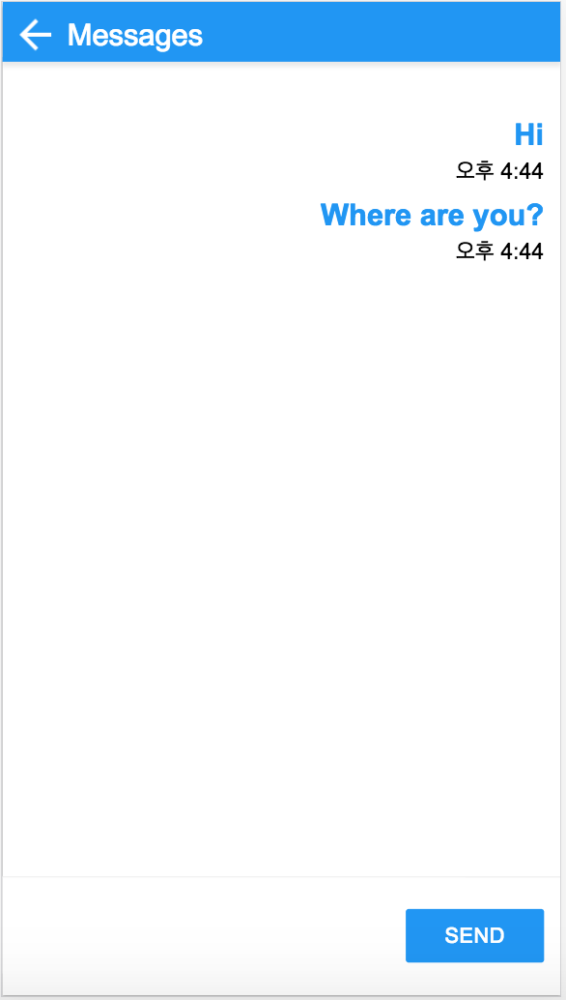

# CS374 Design Project 6 Report

**Team Old Boy**

**Members**: Dohan Kim, Eunseok Jeong, Giwan Park, Jaegyun Kim

**Service Name**: Doki Doki Traveler

----------
###  Experience : Finding travel mates.

----------
### POV
**A traveler who are looking for travel mates** needs to **watch photos of candidates**. Because important information they need is **candidates' appearance, atmosphere, gender, and age**.

----------
### Target Users
Travelers looking for nearby travel mates during a trip.

----------
### Task
1. Pick travel mate who you want to travel with and ask for traveling together.
2. Reply someone's message who want to travel with you.
3. Inform other users about you and your location by uploading photos.

### Implementation Notes:
#### URL of our prototype:
https://dohankim.github.io/HCI_TeamOldBoy/Project/photo_window

**Specific requirements:**
- Works best with the Chrome browser of the Android devices with allowing permission to location access allowed.
- Main page shows photos taken in near area. Therefore, If main page doesn't show any photos, you need to upload some photos in nearby current location.

#### URL of our Git repository:
https://github.com/DohanKim/HCI_TeamOldBoy

#### Libraries and frameworks:
Firebase, Google map, Jquery, MUI(We only used button styles), and font awesome

#### Lessons from heuristic evaluation: 
<!-- List at least three usability issues found by your classmates, and discuss how your prototype addressed them in the current design. -->
- Message might be core functionality, but its button is too small to see
Type: Help & Documentation
Rate: Cosmetic, need not to be fixed
In the current design, the message button is on the bottom of the screen with photo window button and upload button, so the users can easily check the message.

- For users, other user's location is the most important to pick him/her up. However, users can see location after click picture
Type: Flexibilty & Efficiency
Rate: Catastrophic, Imperative to fix
In the current design, the closest 9 photos are shown in page. In this reason, if the user choose travel mate to meet, they do not have to concern about the location because the travel mate is close to the him/her.

- When upload a picture, result have to be shown.
Type: User control & Freedom
Rate: Catastrophic, Imperative to fix
In the current design, when user upload a photo, the photo is displayed on the screen 1 seconds, so the users can check their own photo.

#### Representative screenshots:

##### 1. Photo Window Page
Each 3 photos in a column represent the photo of that side (left / front/ right). When user move it's screen, the photo will be changed by the angle that their screen is headed.
There are 'upload' button in the down side, and when user is not moving it will grow!
Because the longer time of user stay in particular location, the larger possibility that user upload photo in that area.

##### 2. Photo Detail Page -1
When user push one of above images, photo detail pages will be appeared.
As time goes by, 'Send message' button will grow. Because the longer time a user spend to watch a profile, the more likely the user is interested in sending a message.

##### 3. Photo Detail Page -2
Downside of photo detail pages, there are some visual icon that represent the user's information. 
In addition there is a map that shows, when user A is watching user B's photo detail page, places where each A and B visited, and places where other users upload photos frequently at among the places where both of users haven't visited yet.

##### 4. Message Detail Page -1
By pushing 'message' icon, user can send a message. When user is moving, the message and the message icon will be larger that they can write and send mush easier.

----------
### Individual Reflections
<!-- Each member should write this part on their own, reflecting on their own experience. Merge all members' mini-reports in the final report. Answer the following questions:
- Which part the UI did you directly contribute to?
- What were some of the difficulties you faced?
- List one useful implementation skill you learned while working on DP5 and DP6.
(이건 참고하시길!.!) 채점기준
Individual Reflections (15%) -- graded individually
- Individual contribution clearly specified?
- Difficulty discussion has enough depth and insight?
- Non-trivial implementation skill added?
-->

#### Dohan Kim
- Which part the UI did you directly contribute to?
    - Design
        - I devised a concept matching user's movement in real world such as walking and turning around to the UI's action mainly used in photo window. One of the most important obervation of our target user, travlers, was they move a lot while using a smartphone. This characteristic makes our users touching the screen less accurately however it also gives a chance to interact with the system more dynamically as long as we use it well.
        - I devised a concept increasing width of 'Send message' button as time goes by while width of 'Back' button is being decreased in photo detail page. Because from the user interviews I found out that the longer time a user spend to watch a profile, the more likely the user is interested in sending a message.
        - I devised a concept recommending spots to visit in photo detail page. When user A is watching user B's photo detail page, we recommend places where other users upload photos frequently at among the places where both of users haven't visited yet. Because from the oberservations we realized that knowing the places where travel mate candidates already visited is critical factor for users to decide travel mate and planning routes for remaining trip. 
    - Implementation
I implemented photo window page especially its javascript functions. 

- What were some of the difficulties you faced?
    - The most hard thing to do was thinking out of the box. We had too much streotype made by prior experiences using UIs related with photos. Even though we spent long time to brainstorm finding a way to show photos efficiently to travelers, our ealrier versions of UIs were all like Instagram or Facebook-ish timeline. As there was no any correct answer or guideline to destination, we all had felt agony of creator. I learned a lesson that, contrary to mathematical problems, sometimes the best way to solve a problem is just to keep thinking the problem patiently for a long time. 
    - At first, we didn't sure if it is technically possible to track users' movement and orientation. So I had spend time to reasearch and test with real code in various devices. Because of javascript engines' difference of iPhone and various versions of Android as well as smartphone browsers, currently our system is optimal in the Chrome browser of Android device and still somewhat unstable. 

- List one useful implementation skill you learned while working on DP5 and DP6.

Actually I already had some experiences developing web services, so the implementation itself was not that challenging to me except using new APIs for geolocation and orientation of devices. However as it was first time to me developing a service with other programmers, after working on DP5 and DP6, I feel much more confident to use Git with other programmers such as managing branches, merging branches and resolving conflicts.

#### Jaegyun Kim
- Which part the UI did you directly contribute to?
    - Design
          While designing UI, we should focus on the characteristic of our target users and the situations which users might face. We concluded that main characteristic is a user's movement.
        - First, I suggested that we remove the scroll bar in the main page. If there is a scroll bar with plenty of photos, users focus too much on the photos. Therefore, if user scroll down a page to watch more photos while walking on the street where user even don't know well, It is really dangerous. 
 Also, I thought that users should focus on not only contents of our service but also the surroundings such as tourist sites.
 Finally, this idea transformed to the main page view.
        - Second, I suggested that the message element size should be changed automatically based on the day and night. Because, I thought users might move a lot during day time and stay long in specific area such as a hotel in night time. Therefore, in day time, we make the element size big so that users could easily figure out messages other users sent. By contrast, in night time, we wanted to make users to watch more contents in one page. Eventually, the element size of the message page changes as the user moves.
        - Last, we wanted to show the user's itinerary so that users compare their itinerary themselves and make a plan with them easily. Therefore I selected a map view to show where users visited in graphically.
    - Implementation
        - I implemented photo detail page and its javascript functions.
- What were some of the difficulties you faced?

    - Javascript closure concept and asynchronous firebase, google map callback functions.

        - For javascript closure parts, some variables can access to outer functions. In this reason, It is really hard to save a correct value to a correct variable. Therefore, I encapsulated a function which have a variable access problem.

        - For asynchronous firebase and google map callback functions, I changed google map initialize function synchronous. And called a function that set markers in the map after getting firebase data responses.
        
- List one useful implementation skill you learned while working on DP5 and DP6.

Using Google map API to set markers in the map and show some photo modals when users click the marker.
#### Giwan Park
- Which part the UI did you directly contribute to?

I suggested the ideat that the upload button that gets bigger when stay in one place, and implement it. Plus, I implemented the initial structure of our service.

- What were some of the difficulties you faced?

    - Both upload button and photo window uses geolocation. Integrating with those two functionality is greatest difficulty. When I use function that gets geolocation twice, the system is too slow to use. In this reason, I should implement the system have only one geolocation function use, and handles both upload button and photo window drawing. I put the function that handles size of upload button in the function that draws the photo window, so getting geolocation function is called once in a period.
    - Using git with other people makes me confused when I merge my commit or I pull some latest commits.
    - Because our service is worked on mobile environment, I had some trouble about testing with my laptop. There were some weird action like unintentional loading in device orientation function, and I think it is caused by laptop environment.

- List one useful implementation skill you learned while working on DP5 and DP6.

    - Using material UI library.
    - Using jquery animate function when implementing dynamic effect.
    - Using geolocation API to know current position.
    - Using git with other team mates. (push commits, pull commits, and branch control)

#### Eunseok Jeong
- Which part the UI did you directly contribute to?

I implemented message_list and message_detail pages. In particulary, I added special feature that change the size of text when user is moving. Result of that feature, user can see text more easily while they move.

- What were some of the difficulties you faced?

Since it was my first webpage development experience, I did many minor mistakes(grammar mistakes in html/css/JavaScript) that cause a lots of times. But at least I learned a lot from that mistakes:)

- List one useful implementation skill you learned while working on DP5 and DP6.

Since everything was first to me, it's hard to pick one specific skill. Overall, I could be familar with HTML / CSS / Javascript / Git version control than before. 

----------
### Studio Reflections

#### I Like
- the interesting sorting method (a)
- the change of button size (b)

#### I Wish
- the message scroll to the end (c )
- the message input box should be visible in mobile view (d)
- make database inputs sanitized (e)
- add description in photo detail page (f)
- add description in photo map (g)
- add profile picture in message page (h)
- make 'send' button larger for considering certain people (j)
- upload button is visible only when user want to upload photos (k)

#### What If
- the user information could be more iconize (l)
- give user a message that their result of upload (m)

#### Reflections
- Since almost every feedback was important, we implemented (c),(d),(f),(g),(l),(m)
- We will implement (e), (h) before user iteration steps
- For the (j), we already implemented when user is moving the 'send' button became larger.
- For the (k), we decide to keep our original UI because we have special feature that upload button is larger. It's one of our fascinating ideas.
