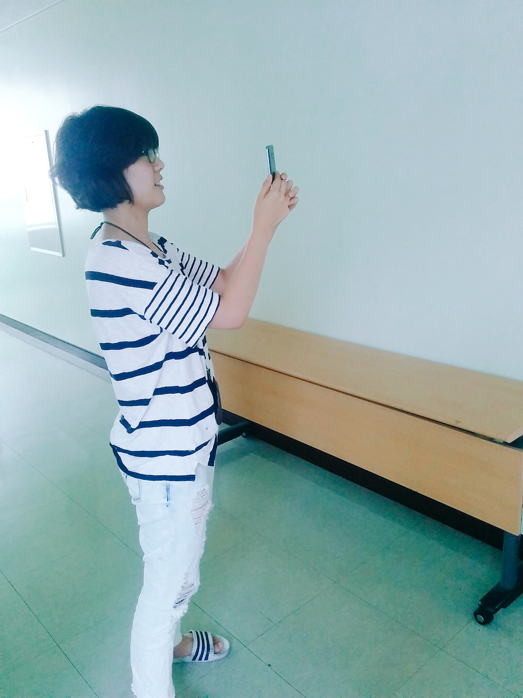
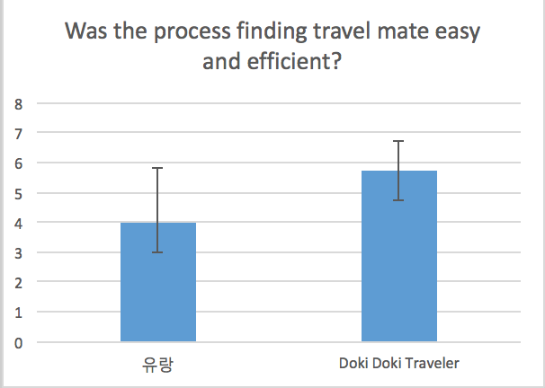

# CS374 Design Project 7 Report

**Team Old Boy**

**Members**: Dohan Kim, Eunseok Jeong, Giwan Park, Jaegyun Kim

**Service Name**: Doki Doki Traveler

----------
###  Written Protocol
<!-- Grading policy
- Preparation and setting information is detailed enough?
- Introduction is concise, to the point, and readable?
- Tutorial or training is well-designed? (if exists)
- Task list and instruction is clearly written and readable?
- Recording strategy is carefully planned, in a way that can capture useful insights?
- Questionnaires and interview questions are carefully thought out to get at deep insights and thought process of participants?
- A debrief prompt is well-written in a polite and informative manner?
-->
**Instructions for preparation & setting up the testing environment**

- Prepare a space at least 3m x 3m large
- Take pictures and upload them here and there surrounding the space 
- Prepare for recording (AirDroid, will be explained later)
- Install a shortcut icon to our service url on an Android smartphone
- Lead the user to stand at the center of the space holding the Android phone

**Introduction and informed consent**

- We made a service that help people find a travel mate. We provide a picture based on your location and it will change by your smartphone’s direction. Feel free to choose anyone you think who would be a nice travel mate and contact them.
- Please assume that all the photos you will see are taken nearby in 3 hours.
- We are not testing you, but our service. Please don’t feel pressured. You may stop or quit the test whenever you want. To not forget your priceless time, is it ok to record your voice and smartphone screen only for research purpose? All of the recorded data will be erased properly after using them.

**Task list & instruction**

1. Pick a travel mate who you want to travel with and ask for traveling together.
    - Photos in the main page were taken nearby in 3 hours.
    - The photos displayed will be changed according to your movement.
    - If you click a photo, you could watch detail information about the person.
2. Reply someone's message who want to travel with you.
    - No instruction, we want to test the visibility of message functions.
3. Inform other users about you and your location by uploading photos.
    - No instruction, we want to test the visibility of upload functions.

**Recording strategy**

- Recording Tools
    - AirDroid
        - Wireless mirroring to the laptop screen.
        - Recording the user experience in laptop.
    - Primitive voice recorder
        - Recording the voice of the user.
    - Handwriting
        - Supplementary way of keeping memorable moments.
- Roles
    - We are going to switch the roles in every sections.

**Questionnaires, Interview questions**

We let users answer quantatively with 1 to 10 scale for the most of the questions and qualitatively for rest of the questions.

* User Information
    * Age, Gender, Job
    * Travel experiences
    * Past experiences finding travel mates
* Functionality & Usability Question (Quantitative)
    * Photo window
        * Did you find attractive travel mate well? (1~10) 
        * Was the chaning the photos according to your movement fun and interesting? (1~10)
        * Was it possible to look through enough number of photos to find travel mates? (1~10)
    * Photo detail
        * Did you have enough information to find travel mate? (1~10)
        * Did you get the meaning of the map? / understand the map? (1~10)
    * Message
        * Did you read message well while you walked? (1~10)
    * Overall UI
        * Did you notice the buttons, alert badges, and other UIs? (1~10)
* Overall Question (Qualitative)
    * Good things, Bad things, Weird things about UI
    * Things what you want to add
* Comparison between our service and existing service, Naver cafe "유랑" (Quantitative)
    * For each services
        * Was the process finding travel mate easy and efficient? (1~10)
        * How much was the travel mate you found attractive? (1~10) 

**Debrief prompt**

Thank you for your participation to our interface test. This test was for the service that we made in CS374 Introduction to HCI course. Your kind feedback will be reflected to our next iteration. If you have more interests in our service, please visit the final presentation held at last week of semester.

----------
### Session Observations
**How we choose testers**
The major characteristic of target users we found out from researching existing services was age similarity. Most of users finding travel mates where in their 20s or early 30s. Except the age, it was hard to find any significant conditions. Therefore, we decided to set our testers as 2 female and 2 male who are in their 20s.

**P1**

She is 21 years old student and traveled to USA, Taiwan, Japan, and Philippines. She has no experience finding a travel mate during a travel. But she said if she is going to travel alone, she would try to find a travel mate.

Summary: She was interested in the map showing where she traveled and the user of the page traveled and also showing recommendation travel places using 3 different color pin points. She suggested one more pin point to show where she want to go in the current location.

**P2**

He is 25 years old student and traveled to U.K, France, Italy, Germany, and Switzerland.
He also doesn't have experience about finding a travel mate. But he will try to find another travel mate if he is traveling alone. However, he is worried about arranging a travel destination with his travel mate because he usually decided on a tight schedule.

Summary: He needed another information such as future travel plan or other information about the user except for the photos.

**P3

She is 25 years old student and traveled to Switzerland, Hong Kong, and Boracay.
She also has no experience in finding a travel mate. But she wants to find a travel mate if she travels alone.

Summary: She tested a lot in the main page. She felt uncomfortable about the main page view. She said the service would be better if the display was more natural. 

**P4**

He is 28 years old student and traveled to France, England, Singapore and Australia.
He had several experience finding travel mates when he traveled.
He also enjoyed sns with the latest technology such as "snow" and "azar".

Summary: He was telling us about the trend of sns these days and suggested us to use video instead of photo.

----------
### Usability Lessons
<!-- List at least 10 usability problems you discovered. Organize them by high-level task or theme, not by each participant or time. But mention which participant ran into the problem by referring to them as P1, P2, ... (e.g., search results did not show the price information (P1, P3)). For each problem, indicate how critical the problem is: high, medium, and low. Finally, show how you plan to address each of the problems.
High-level reflections: What did you overall learn from the user testing experience? What would you do differently for better results and insights? -->

<!-- Grading Policy
- 10+ usability issues submitted?
- Are the usability issues described concretely and clearly?
- Organized by task and theme?
- Level of criticality included?
- High-level reflections are thoughtful and insightful?
-->
Before getting to usablity lessons, This is our questionary results.

The first graph shows that the users felt our service is more easy and efficient in average. However, the variation of the data is overlaped, so it is not certain result. The second graph shows that our services are more helpful than existing service in finding attractive travel mates.

We set metrics for measuring criticality as below.

- High
    - (Regardless of its size) Design issue that highly affects user's action.
    - Design issue that make major change in our features.

- Medium 
    - Design issue that relate to more than two items (alignment, margin, etc,.)
    - Design issue that relate to new feature

- Low
    - Design issue that relate to specific item (size, color)

#### Photo Window (Task 1, Task 3)
- Usabilty Issue (High - P1,P2,P3,P4) : There was no enough instruction or information about what each 9 photos means. (learnability)
    -  Solution : To increase affordance(natural mapping), make the animation in photo window page more softly.

- Usabilty Issue (High - P1,P2,P3,P4) : When user upload photos, there was not enough information whether the upload was successfull. (user feedback)
    - Solution: To incrase feedback, display uploaded photo at the photo window.

- Usabilty Issue (Medium - P1,P3): The change of photo is too fast for user, which leads them confused. (learnability, visiblity)
    - Solution: To increase learnablity, make the change of photo slower.(Change the angle interval from current 30˚)

#### Photo Detail (Task 1)
- Usabilty Issue(Medium - P2,P3):  User didn't watch the information in the map. (learnablity) 
    - Solution: Make the information of each icon in the map more larger. In addition, provide more than one recommendation and change the size and color of star.
- Usabilty Issue(High - P1,P2,P3,P4): There was no enough information for travel mates.
    - Solution: Add more information about each travel mate candidates
- Usabilty Issue(Low - P3): User felt the shrinking of menu bar as advertisement. (learnability)
    - Solution: Make the animation more slow and soft that user perceive it as feature of our services

#### Message Box (Task 1,Task 2)
- Usabilty Issue(Medium - P1, P3): 'Message send' button overlap the user input region that user cannot see some texts. (safety)
    - Solution: Make the user input region smaller (just until the send button)
- Usabilty Issue(Low - P2, P3): When user is moving only the text is became larger, not the button. (consistency)
    - Solution: Make the button also larger that user cannot feel confused.

#### Overall Design (Task 1 , Task 2, Task 3)

- Usabilty Issue(Low - P2) : The size of top menu bar in service is not consistent. (Visiablity, Learnablity)
    - Solution: Make the size of top menu bar same in every pages.

- Usabilty Issue(Meidum - P1, P4): There is no hyperlink from our service name. (External Consistency)
    - Solution: Locate our service name in every pages and link that button to main pages.

#### High-level reflections

We thought a lot about the new fasinating UI(normally different with existing UI) idea a lot and applied it our service. 

However, currently almost every people use smartphone and they have many experience with many services and application. Therefore it's very important to have consistency with existing services. 

Making new UI and finding good aspects in existing UI is both important.

Based on these reflections we made our goals and plan for iteration.

----------
### Plan for Iteration
<!-- You'll have an additional week to finalize your overall design process. Discuss in your team how to use this time most effectively, and make a few concrete goals. Justify your goals. -->
<!-- Grading Policy
- Is the plan for improvement reasonable and concrete?
- Are the goals well-justified?
-->

#### Goals
Our system's UI naturally has low external consistency because the interaction method using users' movement and orientation is not being widely used. It means learnability of our UI would be low, and it is also observed in user testing. So we decided to put our effort to **improve affordance and give more feedback to user** during the last iteration period to **make the UI more learnable**.

#### Plan for Improvement
- Add animated effects (smooth transitions) to help clearer mapping between users actions and UI actions as the columns of photos move.
- Show uploaded photo to notice to users whether the photo is uploaded or not. It is more useful feedback to user.
- Make the width of header line and width of menubar same to make UI have higher internal consistency.
- Make the hyperlink to home in title of service, "DokiDokiTraveler" to make higher external consistency. Usually, when the user clicks logo or title of web service, page goes to home page.
- Display title in center of header to make more mobile friendly UI.
- Display time and location of uploaded photos to give information to users.
- Give message list size changing effect same with messages to make higher internal consistency, and to help user make clearer mapping between users actions and UI actions.

----------
### Studio Reflections
<!-- Summarize the feedback from the studio session, and mention how you addressed it or will address it later in the process. -->
<!-- Grading Policy
- Is feedback well summarized?
- Is feedback addressed, or is the plan for addressing feedback concrete?
-->
#### Feedback Summary
- Is the photo based system well implemented? It seems like there were several technical difficulties, so you should concern about the validity of your system.
- You should have some solution about unexpected situation.
- Is all questions in the interview session open questions? Subjects are not likely to answer open ended question long, so you had better make seletive questions.
- Design your question specifically for subjects to answer easily.
- What kind of demographic information you gather?
- How do you make "dummy attractive travel mate candidates"? In other word, how do you design the initial setting of interview?
- You should make your test more concrete.

#### Reflections
- Our system already has fundamental functionalities like changing photos with orientation of smartphone, but still we have some glitches in our system. For example, when the photo is changed, the transition is not continuous. Therefore, we decided to do more implementation to make smoother system in next iteration. Plus, we are going to handle unexpected situation observed in user interview in next iteration.
- In the presentation, the interview questions are open ended questions, but we changed the questions to what let users select between 1-10 before the user interview. 1 means not satisfied at all, and 10 means fully satisfied. Also, we adjusted the question statements more clear and concrete.
- We gathered the age, gender, occupation, travel experience, and experience finding travel mates as the demographic information.
- We made dummy users to set interview environment. The photos of dummy users are from profile of users of facebook group, "유럽 어디까지 가봤니" and from google image search result, "남자 여행 인스타".
- We redesign user testing method. First, we added procedure that use existing service finding travel mates. In other word, tester uses both our service and current service, and answer the question. Also, we added the question which compares our service and existing service.

